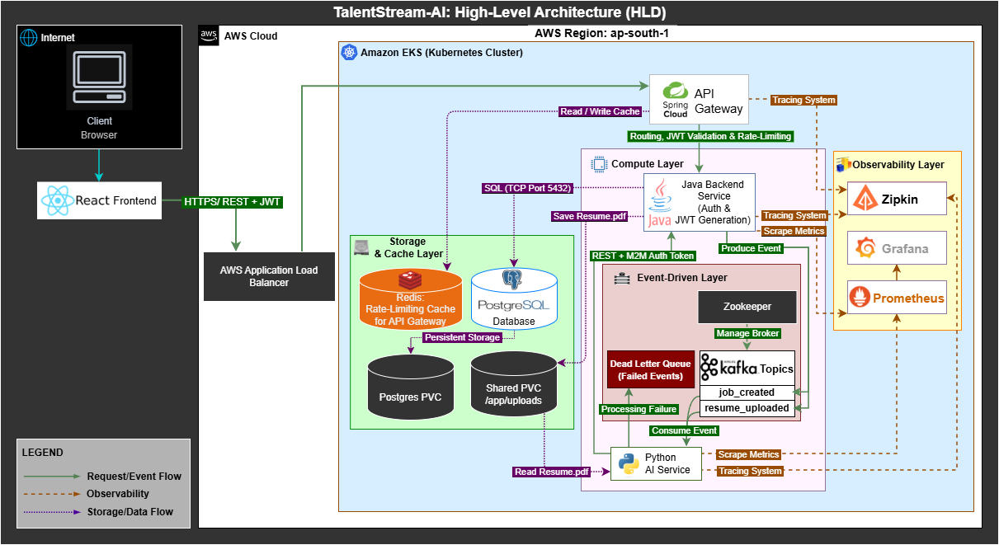
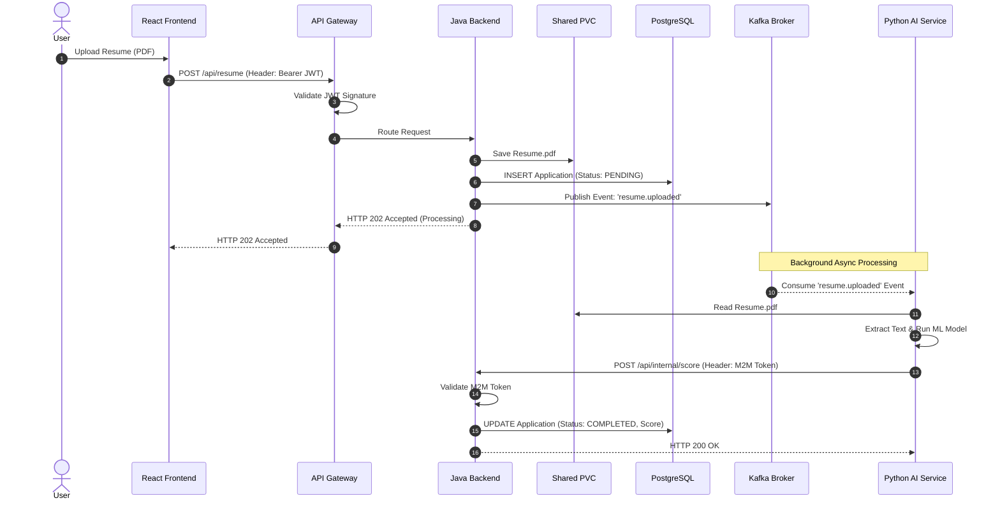
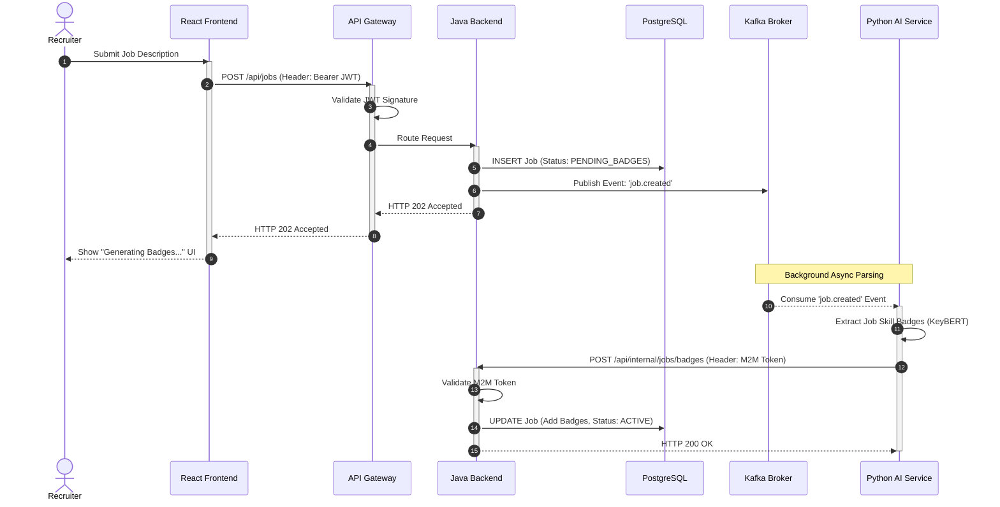
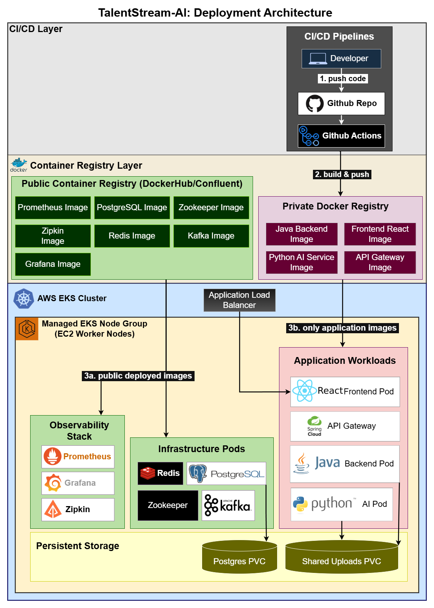

# 🚀 TalentStream-AI


A dual-sided, cloud-native platform that empowers recruiters with AI-generated job badges and evaluates candidate resumes asynchronously using Kafka, Spring Boot, FastAPI, and Kubernetes.

### 🌟 Project Highlights
* **Dual-sided workflows:** Automated job-parsing for recruiters and resume-scoring for candidates.
* **Event-driven architecture** decoupling heavy AI inference via Apache Kafka.
* **Kubernetes deployment** on AWS EKS with continuous delivery.
* **Zero-trust internal security** with Machine-to-Machine (M2M) authentication.
* **Distributed tracing** across all platform components using Zipkin.
* **Automated CI/CD** pipeline via GitHub Actions.

---

## 🎯 Problem Statement

Traditional applicant tracking systems suffer from synchronous bottlenecks:
`User Uploads PDF` ➡️ `Backend Waits` ➡️ `ML Model Executes` ➡️ `Response Returns`

This approach increases user-facing latency, blocks backend application threads, and severely limits horizontal scalability.

**The Solution:** TalentStream-AI introduces an event-driven architecture. By moving the heavy ML inference workloads to Apache Kafka, users receive an `HTTP 202 Accepted` response in under 200ms. The AI safely processes document extraction and skill-matching in the background, updating the database via internal webhooks upon completion.

---

## ⚖️ Architecture Decisions & Trade-offs

| Decision | Reason / Trade-off |
|-----------|---------|
| **Kubernetes over Docker Compose** | Enables production-grade orchestration, auto-restarts, rolling deployments, and built-in service discovery. |
| **Kafka over REST callbacks** | Prevents backend thread blocking during heavy, unpredictable ML processing times. |
| **Shared K8s PVC over S3** | Optimized for simpler v1 cluster deployment without creating external AWS IAM dependencies. Reduces external cloud provider coupling and simplifies local replication/testing, though S3 remains the target for production-grade horizontal scaling.|
| **PostgreSQL** | Provides strong ACID consistency for critical user application state. |
| **PostgreSQL, Kafka, Redis inside EKS** | For V1, PostgreSQL, Kafka, and Redis are self-hosted inside EKS to simplify deployment and reduce cloud service dependencies. Future iterations may migrate these components to managed services such as RDS, MSK, and ElastiCache. |

---

## 🏗️ System Architecture

### 1. High-Level Design (HLD)


### 2. Sequence Flow
#### 2.1 Candidate Upload Lifecycle


#### 2.2 Recruiter Job Posting Lifecycle


### 3. Deployment Architecture & CI/CD


---

## 🛠️ Technology Stack

| Layer | Technology |
|---------|------------|
| **Frontend** | React.js |
| **API Gateway** | Spring Cloud Gateway |
| **Backend Orchestrator** | Java, Spring Boot |
| **AI Inference Service** | Python, FastAPI, KeyBERT |
| **Event Stream / Broker** | Apache Kafka, Zookeeper |
| **Database** | PostgreSQL |
| **Caching / Rate Limiting** | Redis |
| **Orchestration** | Kubernetes (AWS EKS) |
| **CI/CD Pipeline** | GitHub Actions, Docker Hub |
| **Observability** | Prometheus, Grafana, Zipkin |

---

## 🤖 The AI Engine (Dual Workflows)

The Python AI service handles two distinct NLP workflows. *Note: The v1 engine prioritizes deterministic keyword matching over deep semantic vector search for explainability.*

**1. The Recruiter Loop (Job Creation):**
When a recruiter posts a job description, the AI service uses **KeyBERT** to automatically extract the core requirements and attaches normalized "Skill Badges" to the job posting.

**2. The Candidate Loop (Resume Upload):**
Extracts raw text from the uploaded PDF resume and computes a weighted relevance score based on keyword overlap frequency against the recruiter's auto-generated Job Skill Badges.

---

## 📨 Event Topics (Kafka Contracts)

| Topic Name | Producer | Consumer | Purpose |
|---------|----------|----------|---------|
| `job.created`     | Java Backend | Python AI Service | Triggers the AI to parse the job description and auto-generate Skill Badges. |
| `resume.uploaded` | Java Backend | Python AI Service | Triggers the async ML scoring pipeline for a candidate's PDF resume. |

---

## 🔐 Security Model & Trust Boundaries

- **Public Entry Point:** The Spring Cloud API Gateway acts as the single public entry point to the cluster.
- **External Authentication:** JWT authentication is strictly enforced for all external user requests at the edge.
- **Internal Zero-Trust:** Internal services are not exposed externally. Machine-to-Machine (M2M) communication between Python and Java is secured using shared-secret API tokens.

---

## 🛡️ Reliability & Failure Recovery

TalentStream-AI implements several fault-tolerance mechanisms to ensure pipeline durability:
* **State Management (The Dual-Write Edge Case):** Applications are persisted in PostgreSQL with a `PENDING` state *before* event publication. This allows operators to easily identify and reconcile incomplete workflows if the Kafka broker goes down.
* **At-Least-Once Delivery:** Consumer offsets are committed only *after* successful ML processing, providing at-least-once delivery guarantees during inference failures.
* **Persistent Volumes:** PVCs ensure that database records and uploaded PDF documents survive pod restarts and crashes.
* **Self-Healing Infrastructure:** Kubernetes Liveness and Readiness probes automatically restart unhealthy Java or Python containers.

---

## 💻 Example API Usage

The platform utilizes an asynchronous pattern for heavy uploads to prevent client blocking.

**Request:**
```http
POST /api/v1/applications/upload
Authorization: Bearer <jwt_token>
Content-Type: multipart/form-data

file: @resume.pdf
job_id: "job_041"
```

**Immediate Response:**
```http
HTTP/1.1 202 Accepted
Content-Type: application/json

{
  "application_id": "app_992",
  "status": "PENDING_AI_ANALYSIS",
  "message": "Resume uploaded successfully. Analysis in progress."
}
```

---

## 📊 Observability Metrics

Comprehensive telemetry is gathered to ensure cluster health and pipeline performance:

* **Distributed Tracing (Zipkin):** End-to-end visibility tracking HTTP requests as they hop across the API Gateway, Java orchestrator, Kafka event stream, and Python inference engine.
* **System & Business Metrics (Prometheus / Grafana):**
  * Resume AI Processing Duration (Business Metric)
  * API Request Latency
  * Kafka Consumer Lag (Unprocessed Events)
  * JVM / Python Memory Utilization
  * Kubernetes Pod Health & Restarts

### Zipkin Trace & Grafana Dashboard
*(Screenshots of Zipkin UI and Grafana)*

---

## 📂 Repository Structure

```bash
talentstream-ai/
├── .github/workflows/      # CI/CD pipelines
├── frontend-react/         # React.js application
├── api-gateway/            # Spring Cloud Gateway
├── backend-java/           # Spring Boot orchestrator
├── ai-service/             # Python FastAPI KeyBERT engine
├── k8s/                    # Kubernetes deployment manifests
├── architecture-diagrams/  # Draw.io / Mermaid visual assets
└── README.md
```

---

## 🚀 Local Deployment (Kubernetes)

To run this architecture locally, ensure you have Docker Desktop (with Kubernetes enabled) or Minikube installed.

**1. Clone the repository:**
```bash
git clone [https://github.com/your-username/talentstream-ai.git](https://github.com/your-username/talentstream-ai.git)
cd talentstream-ai
```

**2. Apply the Infrastructure & Custom Services**
```bash
# Apply stateful storage, databases, and message brokers
kubectl apply -f k8s/postgres-pvc.yaml -f k8s/postgres.yaml -f k8s/redis.yaml -f k8s/zookeeper.yaml -f k8s/kafka.yaml

# Deploy the applications and gateway
kubectl apply -f k8s/backend-java.yaml -f k8s/ai-service.yaml -f k8s/api-gateway.yaml -f k8s/frontend.yaml
```

**3. Apply the Observability Stack**
```bash
kubectl apply -f k8s/zipkin.yaml -f k8s/prometheus.yaml -f k8s/grafana.yaml
```

**4. Verify the Deployment**
```bash
kubectl get pods
```
*Expected Output:*
```text
NAME                                READY   STATUS    RESTARTS
ai-service-pod-xyz                  1/1     Running   0
api-gateway-pod-xyz                 1/1     Running   0
backend-java-pod-xyz                1/1     Running   0
frontend-react-pod-xyz              1/1     Running   0
kafka-broker-pod-xyz                1/1     Running   0
postgres-db-pod-xyz                 1/1     Running   0
redis-cache-pod-xyz                 1/1     Running   0
zookeeper-pod-xyz                   1/1     Running   0
```
**5. Access the Platform:**

* **React Frontend:** http://localhost:3000 (via NodePort/Port-Forward)
* **Zipkin Tracing:** http://localhost:9411
* **Grafana Dashboards:** http://localhost:3001

---

## ☁️ Production Deployment (AWS EKS)

This application is fully provisioned in the cloud utilizing a managed Kubernetes environment.

* **Cloud Provider:** AWS (ap-south-1)
* **Cluster:** Amazon EKS (Elastic Kubernetes Service)
* **Compute:** Managed EKS Worker Nodes
* **Delivery:** Automated GitHub Actions pipeline to Docker Hub

**Verify Cloud Deployment Health:**
```bash
kubectl get pods -n default
```
*Expected Output:*
```text
NAME                                READY   STATUS    RESTARTS
ai-service-pod-xyz                  1/1     Running   0
api-gateway-pod-xyz                 1/1     Running   0
backend-java-pod-xyz                1/1     Running   0
frontend-react-pod-xyz              1/1     Running   0
kafka-broker-pod-xyz                1/1     Running   0
postgres-db-pod-xyz                 1/1     Running   0
redis-cache-pod-xyz                 1/1     Running   0
zookeeper-pod-xyz                   1/1     Running   0
```

---

## 🎥 Cloud Deployment Demo
*A 3-minute technical walkthrough of the live AWS EKS cluster, the Kafka asynchronous event queue, and the Zipkin trace logs.*

> **[Video Demo Link Here]**